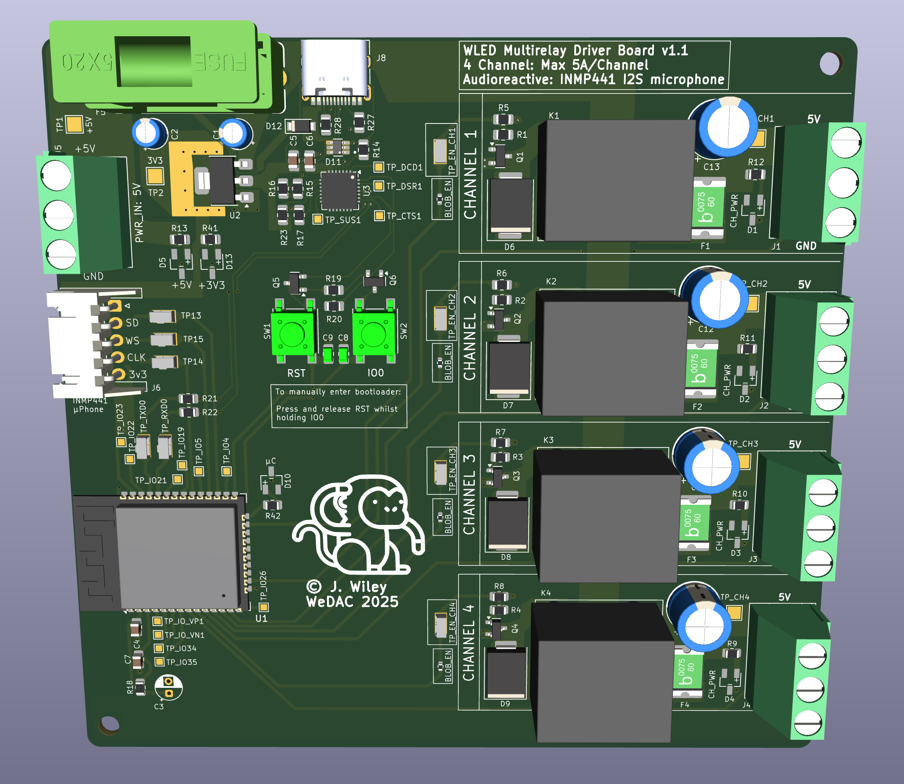
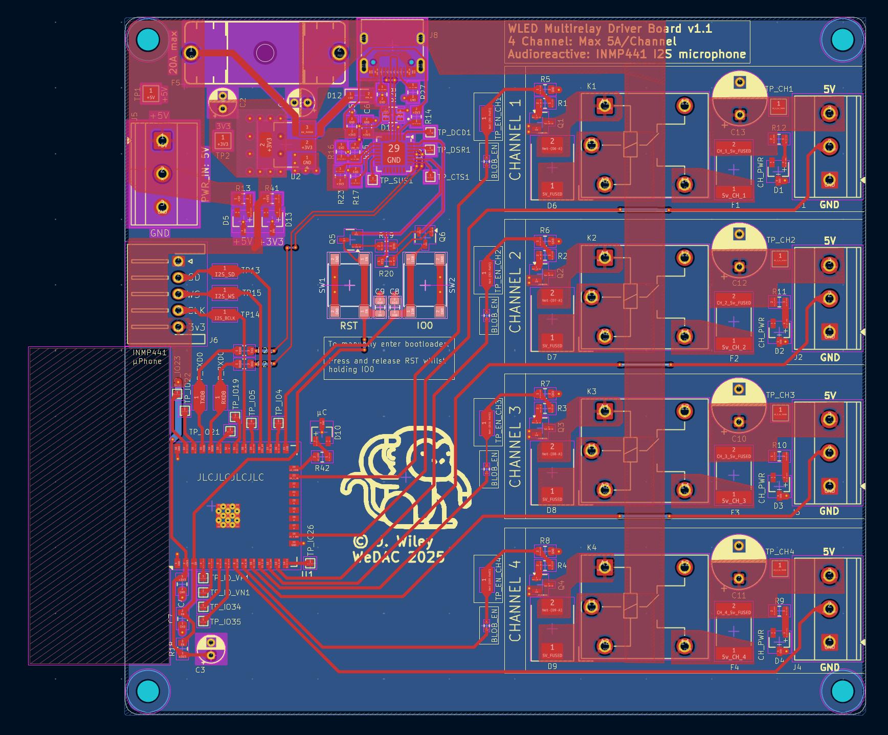
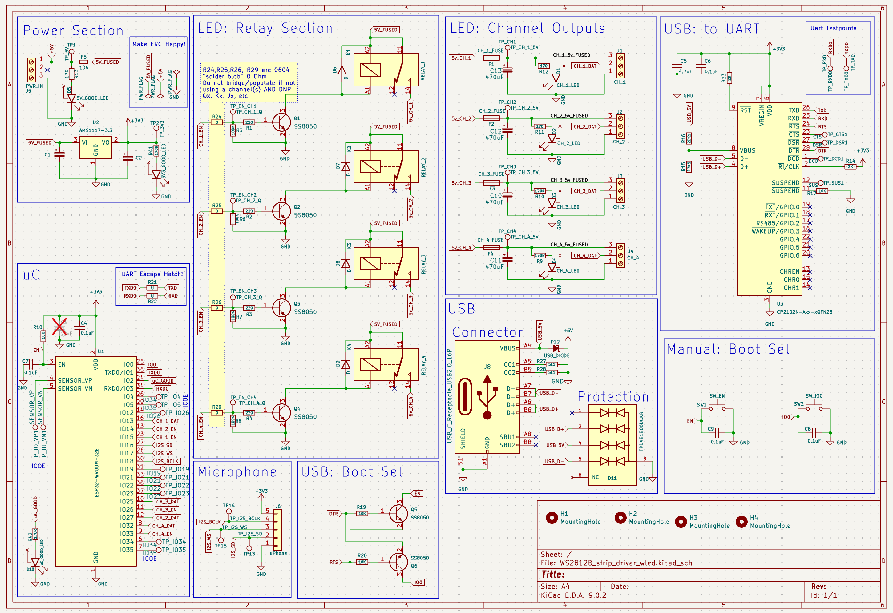

# 4 Channel WS2812B WLED driver

## Disclaimer/Licence

This project (4 Channel WS2812B WLED driver - henceforth know as "The Project") is dual licenced.

If you want to use The Project for your own personal purposes (i.e. for your own use, not for financial/commercial gain), then please feel free to use and modify it as needed. No warrentee is given and no liability is assumed by me.

If you wish to use The Project, or any aspect of it, commercially please seek my permission.  I DO NOT give consent for any of the work in The Project to be used for commercial gain by others unless with my express agreement. If terms can be agreed commercially, consent will be provided by me in writing. If you do not have such consent in writing from me, you do not have the right to use The Project, or any aspect of it, commercially.

## What is this?

I wanted a custom WS2812B board, capable of driving up to 4 strips.

I have some decent Meanwell +5v high-current PSUs on hand, and this board is designed to be fed by something like that. There's a distinct lack of overcurrent protection (apart from the obvious 5mmx20mm fuse for whole board and a 5A LF resettable fuse/channel) and I'm relying on a well-made and well-specced power supply for the rest. There's no reverse voltage protection, for instance, but the PWR_IN connector is clearly marked which end is which!

A custom build of WLED including the multirelay usermod will be needed, to make this board work. I'll probably get round to updating this readme with instructions/config at some point.

If you make up a jst-xh 1x5 connector and wire it to a INMP441 microphone off-board somewhere, then you can activate the Audioreactive usermod and enjoy some beats-driven lighting.

## Board 3d Render

## PCB Layout

## Schematic

